# Windows Server 2022 — Installation & Initial Setup

## Description

A step-by-step walk-through of configuring network interface settings, verifying DNS resolution, and joining a Windows 10 workstation to an Active Directory domain (homelabactivity.local). This procedure ensures proper communication between client machines and the domain controller within the virtual lab environment.

## Environment Used

- Windows Server 2022
- Windows Server 2022 (Domain Controller / DNS Server)
- VMware Workstation

## Lab walk-through

Navigate to Network & Internet settings to view connection status and access network configuration options.
  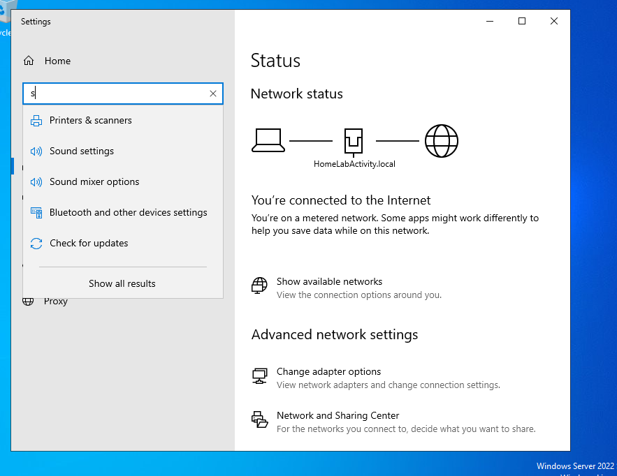

Open the Network Connections window to view available network adapters.
  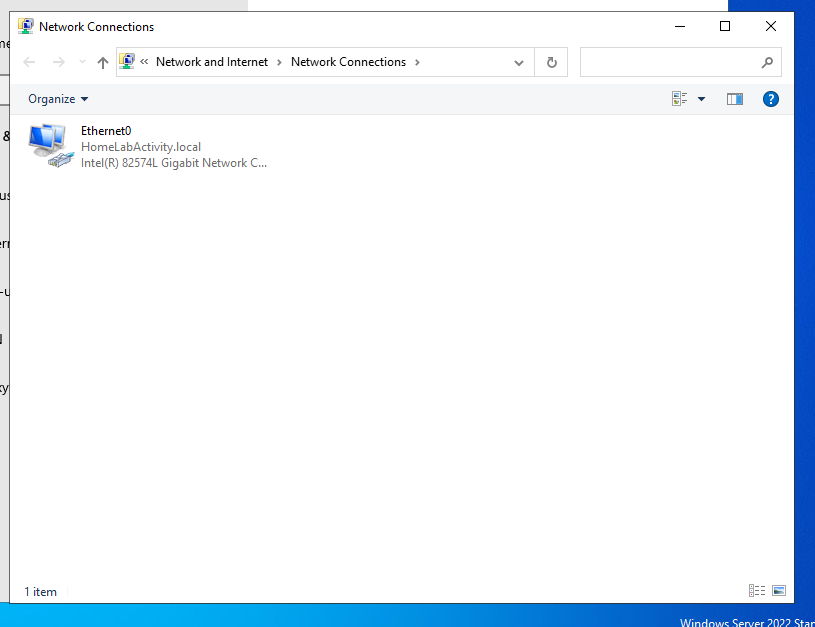

Select the Ethernet adapter to configure properties for domain connectivity.
  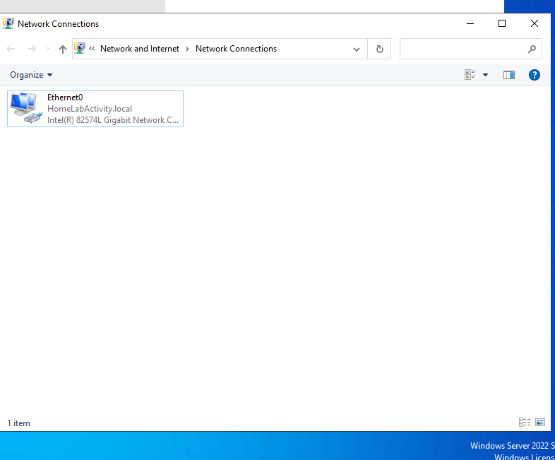

Access the Ethernet properties menu and select Internet Protocol Version 4 (TCP/IPv4).
  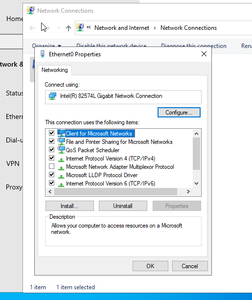

Execute ipconfig in Command Prompt to verify current IP address configuration and default gateway details.
  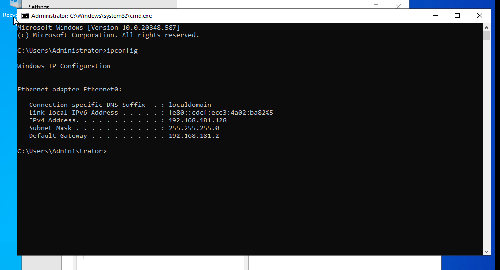

Configure static IP settings, setting the Preferred DNS server to loopback or local server IP for testing.
  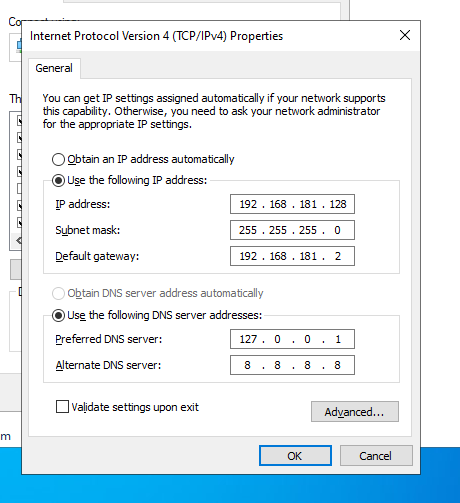

Verify network status reflecting private network connection established on Ethernet0.
  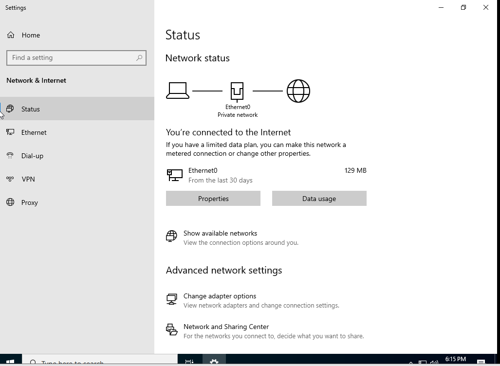

Update IPv4 DNS settings to point directly to the Active Directory Domain Controller IP address in Client Account
  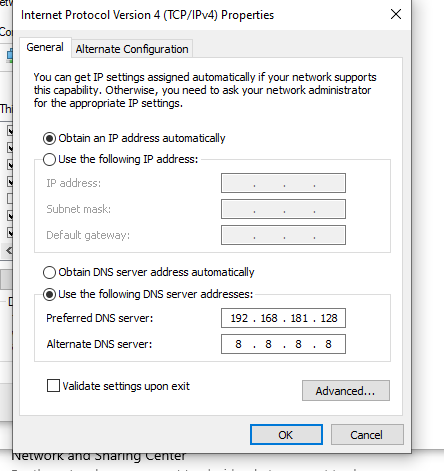

Test connectivity using ping and perform nslookup to verify domain name resolution for homelabactivity.local.
  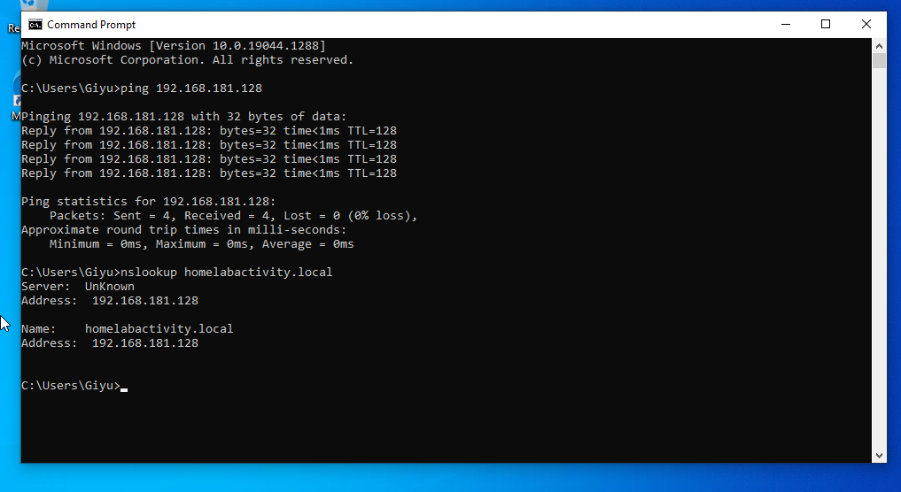

Open System Properties, enter the domain name homelabactivity.local,  and rename the computer to Computer-01 to join the domain.
  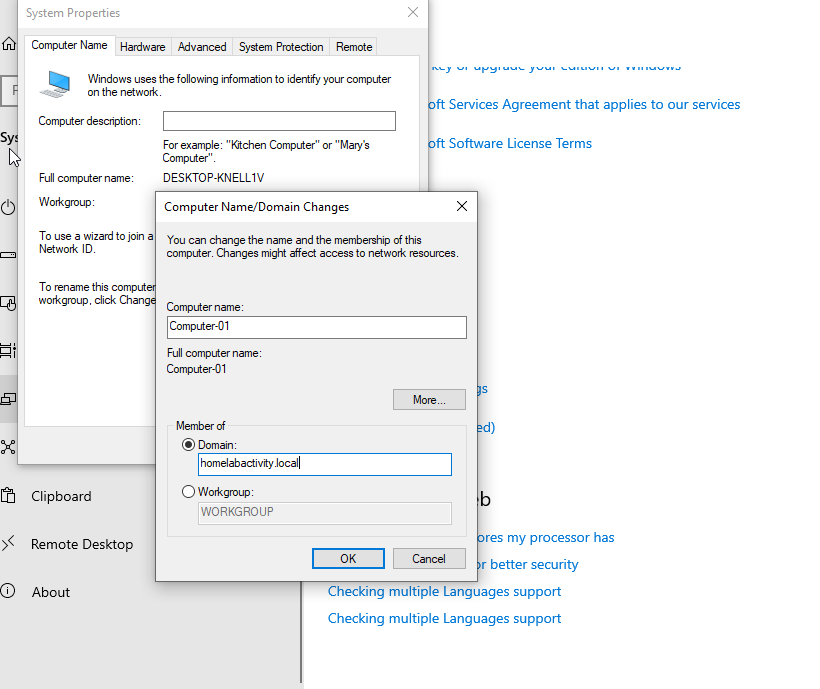

Authenticate with domain administrator credentials to authorize joining the domain.
  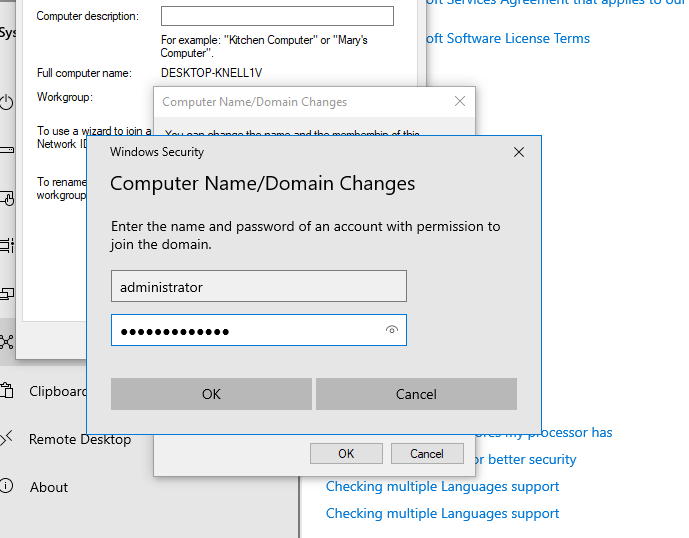

Confirm successful domain join upon receiving the welcome message for homelabactivity.local.
  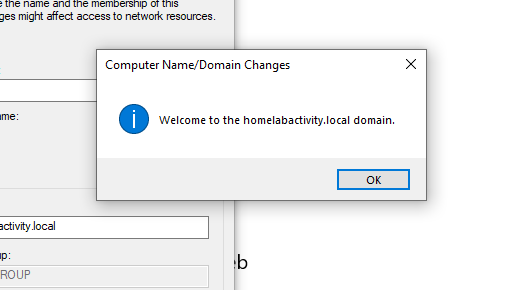

Verify the newly added client computer object within the Computers container in Active Directory Users and Computers on the Domain Controller.
  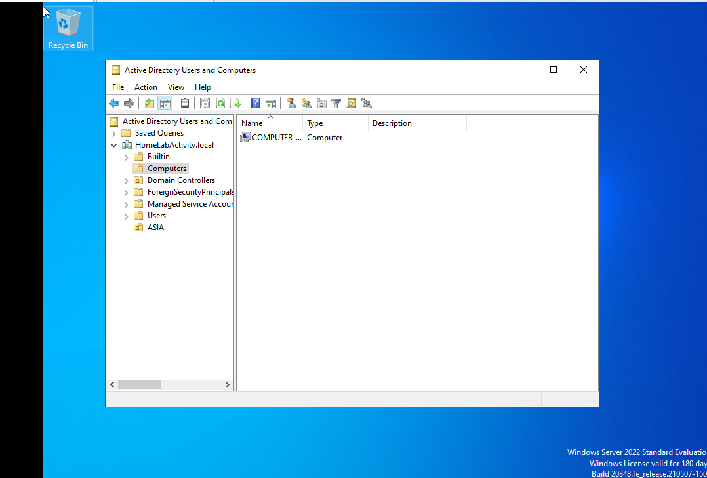

